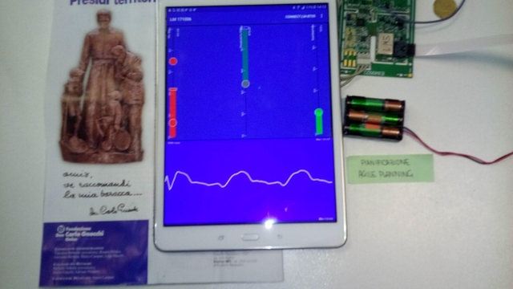

# LM_Android

Android application for controlling the LiberMano device

Libermano is a system for restoring movements. (A branch of the MeCFES system https://mecfes.wikispaces.com/)

The parts are 

> * Mechanical

> * Electronics

> * Software

This repository is the Android application which controls the electronics via bluetooth.

History:

Iteration 2016: Student thesis :

["DEVELOPMENT OF A SOFTWARE APPLICATION FOR THE REMOTE CONTROL OF A NEUROPROSTHESIS RUNNING ON ANDROID AND ON A PERSONAL COMPUTER" by Giulia Ravasio  ](https://www.politesi.polimi.it/bitstream/10589/135434/3/2017_07_Ravasio.pdf)

[https://www.politesi.polimi.it/bitstream/10589/135434/3/2017_07_Ravasio.pdf](https://www.politesi.polimi.it/bitstream/10589/135434/3/2017_07_Ravasio.pdf)

Description of the hardware iterration 2016 can be found here:

["DESIGN AND IMPLEMENTATION OF THE FIRMWARE OF A NEUROPROSTHESIS FOR THE PARETIC HAND " by Mattia Schiavone]( https://www.politesi.polimi.it/bitstream/10589/135441/3/2017_07_Schiavone.pdf)  

 [https://www.politesi.polimi.it/bitstream/10589/135441/3/2017_07_Schiavone.pdf](https://www.politesi.polimi.it/bitstream/10589/135441/3/2017_07_Schiavone.pdf)

----
 This file has been created with [lmmx](https://github.com/lmmx)/[gdocs2md-html](https://github.com/lmmx/gdocs2md-html)

